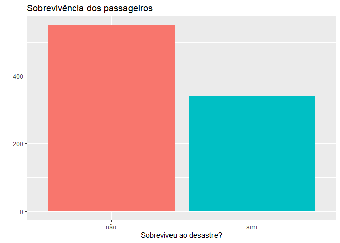
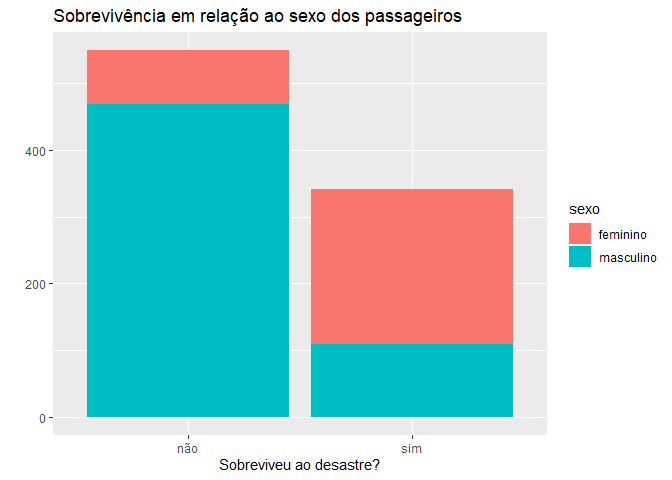
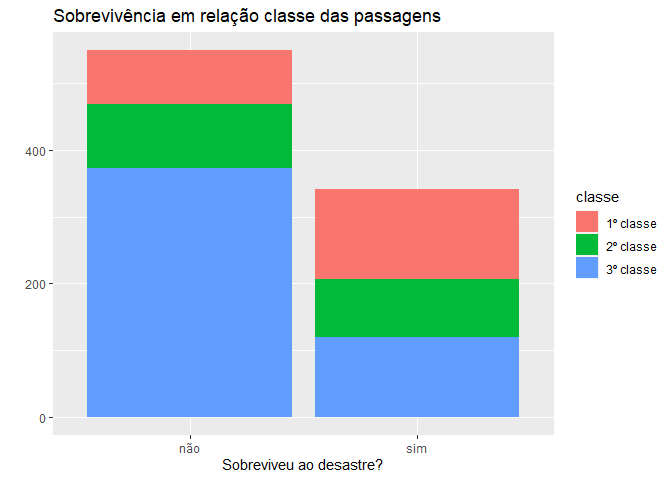
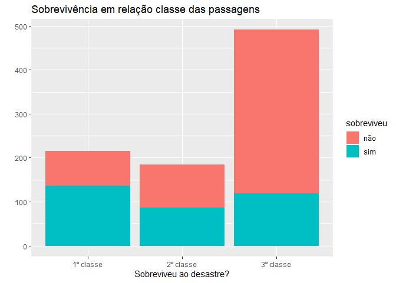
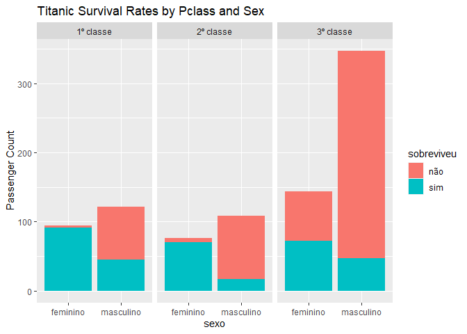
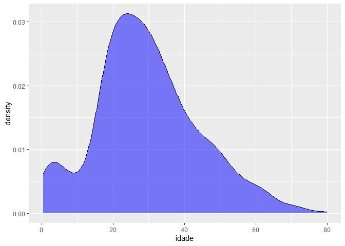
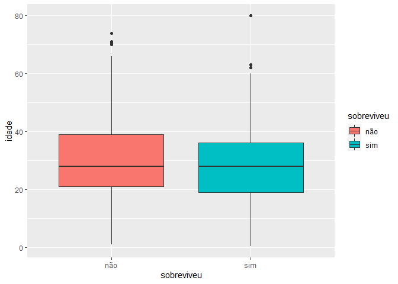
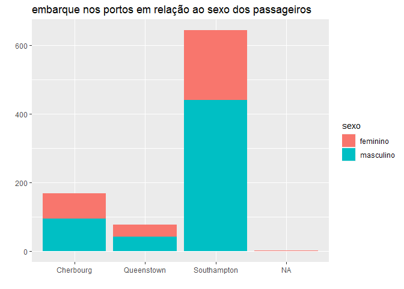

Lição GitHub nº 04
================
Michely Santos Piropo </br>
Estat 2020.2

------------------------------------------------------------------------

## 1. Conhecendo o *dataset*

Para carregar o *dataset* `titanic.csv`, use a função `read_csv()`.

``` r
titanic <- read_csv("titanic.csv")
```

Explore, inicialmente, as variáveis de seu *dataset* com a função
`glimpse()`

``` r
titanic %>% glimpse()
```

    ## Rows: 891
    ## Columns: 11
    ## $ nome           <chr> "Braund, Mr. Owen Harris", "Cumings, Mrs. John Bradley ~
    ## $ sexo           <chr> "masculino", "feminino", "feminino", "feminino", "mascu~
    ## $ idade          <dbl> 22, 38, 26, 35, 35, NA, 54, 2, 27, 14, 4, 58, 20, 39, 1~
    ## $ sobreviveu     <chr> "não", "sim", "sim", "sim", "não", "não", "não", "não",~
    ## $ pais_filhos    <dbl> 0, 0, 0, 0, 0, 0, 0, 1, 2, 0, 1, 0, 0, 5, 0, 0, 1, 0, 0~
    ## $ conjuge_irmaos <dbl> 1, 1, 0, 1, 0, 0, 0, 3, 0, 1, 1, 0, 0, 1, 0, 0, 4, 0, 1~
    ## $ passagem       <chr> "A/5 21171", "PC 17599", "STON/O2. 3101282", "113803", ~
    ## $ classe         <chr> "3º classe", "1º classe", "3º classe", "1º classe", "3º~
    ## $ preco_passagem <dbl> 7.2500, 71.2833, 7925.0000, 53.1000, 8.0500, 8.4583, 51~
    ## $ cabine         <chr> NA, "C85", NA, "C123", NA, NA, "E46", NA, NA, NA, "G6",~
    ## $ porto_embarque <chr> "Southampton", "Cherbourg", "Southampton", "Southampton~

**Questão 01.** Quais variáveis são quantitativas (numéricas) e quais
são qualitativas (categóricas)?</br> *Resp.* As variáveis categóricas
são; nome, sexo, sobreviveu, passagem, classe, cabine e porto de
embarque. e as quantitativas são; idade, pais e filhos, conjuge irmãos e
preço passagem.

### 1.1 Visualizando o *dataset* como uma planilha

Use o comando `view()` (note que está escrito em letra minúscula) para
ter uma visão mais geral dos dados, como em uma planilha.

``` r
titanic %>% view()
```

## 2. Usando a função `filter()` e `select()`

### 2.1 Selecionado variáveis

Vamos selecionar a variável `porto_embarque` e determinar de quais
portos os passageiros embarcaram. Para isso, usaremos a função
`select()` para selecionar a variável `porto_embarque` e depois usar a
função `distinct()` para retornar os portos de forma única.

``` r
titanic %>% 
  select(porto_embarque) %>% 
  distinct()
```

    ## # A tibble: 4 x 1
    ##   porto_embarque
    ##   <chr>         
    ## 1 Southampton   
    ## 2 Cherbourg     
    ## 3 Queenstown    
    ## 4 <NA>

**Questão 02.** Pesquise na internet as regiões (países) de cada porto
em questão. </br> *Resp.:*Southampton; Reino Unido, Cherbourg; França,
Queenstown; Nova Zelândia.

### 2.2 Filtrando informações

Use a função `filter()` para determinar o nome da pessoa que possui 80
anos de idade.

``` r
titanic %>% 
  filter(idade == 80.00) 
```

    ## # A tibble: 1 x 11
    ##   nome        sexo   idade sobreviveu pais_filhos conjuge_irmaos passagem classe
    ##   <chr>       <chr>  <dbl> <chr>            <dbl>          <dbl> <chr>    <chr> 
    ## 1 Barkworth,~ mascu~    80 sim                  0              0 27042    1º cl~
    ## # ... with 3 more variables: preco_passagem <dbl>, cabine <chr>,
    ## #   porto_embarque <chr>

**Questão 03.** Qual o sobrenome dessa pessoa? Ele possui parentes ou
cônjuge que estavam no navio? </br> *Resp.* Barkworth,não.

## 3. Observando as coisas …

Rode o código abaixo e veja um gráfico de colunas que relaciona a tabela
de frequência da variável `sobreviveu`.

``` r
titanic %>%
  ggplot(aes(x = sobreviveu, fill = sobreviveu)) +
  geom_bar(show.legend = FALSE) +
  labs(
    title = "Sobrevivência dos passageiros",
    x = "Sobreviveu ao desastre?",
    y = ""
  )
```

<!-- -->

**Questão 04.** Houve mais mortes ou mais sobrevivência no desastre?
Quanto você estimaria de mortes e sobrevivência?</br> *Resp.* Mais
mortes. 550 mortes e 350 sobreviventes.

### 3.1 Sabendo a quantidade exata

Como saber a quantidade exata de mortes nesse desastre? Para isso,
depois de selecionar a variável `sobrevivel`, faremos um filtro
estabelecendo uma relação lógica com a resposta `"não"`. E, depois,
contar o resultado.

``` r
titanic %>% 
  select(sobreviveu) %>% 
  filter(sobreviveu == "não") %>% 
  count()
```

    ## # A tibble: 1 x 1
    ##       n
    ##   <int>
    ## 1   549

**Questão 05.** Quantas pessoas não sobreviveram a esse desastre? </br>
*Resp.* 549 pessoas não sobreviveram a esse desastre.

#### 3.1.1 Sendo mais prático com `group_by()` ou `count()`

No início desse texto, quando usamos a função `glimpse()`, vimos que
haviam 891 linhas (*rows*). Tais linhas (ou observações) representam,
nesse *dataset*, a quantidade de pessoas. Logo, fazendo uma diferença
simples desse total com o número de pessoas que morreram, você
descobreirá a quantidade de pessoas que **sobreviveu** ao desastre.

Obviamente, esse processo pode ser mais rápido. Poderíamos saber logo a
quantidade, em cada um dos casos, usando a função `n()` dentro da
`summarise()`

``` r
titanic %>% 
  group_by(sobreviveu) %>% 
  select() %>% 
  summarise(
    n = n()
  )
```

    ## # A tibble: 2 x 2
    ##   sobreviveu     n
    ##   <chr>      <int>
    ## 1 não          549
    ## 2 sim          342

O código acima poderia ser drasticamente reduzido se usarmos a função
`count()`.

``` r
titanic %>% 
  count(sobreviveu)
```

    ## # A tibble: 2 x 2
    ##   sobreviveu     n
    ##   <chr>      <int>
    ## 1 não          549
    ## 2 sim          342

### 3.2 Comparando os sexos

Rode o código abaixo e veja a sobrevivência relacionada ao sexo dos
passageiros.

``` r
titanic %>% 
  select(sobreviveu, sexo) %>% 
  ggplot(aes(x = sobreviveu, fill = sexo)) +
  geom_bar() +
  labs(
    title = "Sobrevivência em relação ao sexo dos passageiros",
    x = "Sobreviveu ao desastre?",
    y = ""
  )
```

<!-- -->

**Questão 05.** Diante do gráfico anterior, qual em qual sexo a
quantidade de mortes foi maior? Por que você acha que isso ocorreu?
</br> *Resp.* As mortes dos homens, porque na hora da tragedia era
prioridade salvar mulheres e crianças.

#### 3.2.1 Morte por classe da passagem

Talvez uma perguta tenha surgido … Como seria a distribuição da
sobrevivência relacionada às classes das passagens?

``` r
titanic %>% 
  select(sobreviveu, classe) %>% 
  ggplot(aes(x = sobreviveu, fill = classe)) +
  geom_bar() +
  labs(
    title = "Sobrevivência em relação classe das passagens",
    x = "Sobreviveu ao desastre?",
    y = ""
  )
```

<!-- -->

Talvez, se trocássemos as variáveis de posição, a ideia do gráfico
ficaria mais clara:

``` r
titanic %>% 
  select(sobreviveu, classe) %>% 
  ggplot(aes(x = classe, fill = sobreviveu)) +
  geom_bar() +
  labs(
    title = "Sobrevivência em relação classe das passagens",
    x = "Sobreviveu ao desastre?",
    y = ""
  )
```

<!-- -->

**Questão 06.** Qual a sua interpretação para esse fato? </br> *Resp.*
Que as pessoas da 3º classe morreram mais.

#### 3.2.2 Juntando tudo

Também podemos analisar a sobrevivência entre os sexos distribuídas em
cada classe de passagem. Rode o código abaixo e veja tal distribuição.

``` r
titanic %>% 
  ggplot(aes(x = sexo, fill = sobreviveu)) + 
  geom_bar() +
  facet_wrap(~ classe) +
  labs(y = "Passenger Count",
       title = "Titanic Survival Rates by Pclass and Sex")
```

<!-- -->

### 3.3 E as idades?

Rode o código abaixo e veja a distribuição da idade de todos os
passageiros.

``` r
titanic %>% 
  ggplot(aes(idade)) +
  geom_density(fill = "blue", alpha = 0.5)
```

    ## Warning: Removed 177 rows containing non-finite values (stat_density).

<!-- -->

Se quisermos saber a média ou a mediana das idades, podemos usar a
função `summarise()`:

``` r
titanic %>% 
  select(idade) %>% 
  drop_na() %>% 
  summarise(
    media_idade = mean(idade),
    mediana_idade = median(idade)
  )
```

    ## # A tibble: 1 x 2
    ##   media_idade mediana_idade
    ##         <dbl>         <dbl>
    ## 1        29.7            28

**Questão 07.** Qual a média das idades? Qual a mediana? </br> *Resp.*
Média 29.7, mediana 28.

#### 3.3.1

Observe o boxplot abaixo (rode o código):

``` r
titanic %>% 
  ggplot(aes(x = sobreviveu, y = idade, fill = sobreviveu)) +
  geom_boxplot()
```

    ## Warning: Removed 177 rows containing non-finite values (stat_boxplot).

<!-- -->

**Questão 08.** O que você pode afirmar sobre a mediana das idades dos
passageiros, em relação à sua sobrevivência ou não? </br> *Resp.* Que
mais passageiros com a idade proxima da mediana sobreviveram.

## 4. Para pensar e responder

**Questão 09.** Como você determinaria a quantidade dos homens, da 1º
classe, não sobrevimentes ao naufrágio, que possuiam idade entre 20 e 30
anos (incluíndo esses extremos)? </br> *Resp.* Atráves da média.

**Questão 10.** Qual outra curiosidade você desejaria saber sobre esse
conjunto de dados? Proponha uma questão que não tenha sido abordada nas
perguntas anteriores e, em seguida, responda-a utilizando o `R`. *Resp.*
qual a relação entre o embarque e o sexo dos passageiros do navio
titanic?

``` r
titanic %>% 
select(porto_embarque, sexo) %>% 
    ggplot(aes(x = porto_embarque, fill = sexo)) +
    geom_bar() +
     labs(
         title = "embarque nos portos em relação ao sexo dos passageiros",
         x = "",
         y = ""
     )
```

<!-- -->
